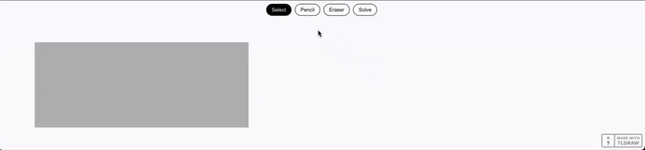

# Math Notes

A web application that solves handwritten mathematical expressions. Write or draw your math problem on the canvas, and get instant solutions.


## Features

- Draw mathematical expressions on an interactive canvas
- Solve equations, derivatives, integrals, and more
- Real-time results displayed on the canvas
- Built with Next.js, Tl:Draw, Flask, and SymPy

## Getting Started

### Frontend Setup

```bash
# Navigate to frontend directory
cd frontend

# Install dependencies
npm install

# Start development server
npm run dev
```

Visit `http://localhost:3000` in your browser.

### Backend Setup

```bash
# Navigate to server directory
cd server

# Create virtual environment
python -m venv venv

# Activate virtual environment
source venv/bin/activate  # On Windows: venv\Scripts\activate

# Install dependencies
pip install -r requirements.txt

# Start server
python app.py
```

Server runs on `http://localhost:5001`.

## How to Use

1. Open the application in your browser
2. Use the drawing tools to write your math expression
3. Click "Solve" to evaluate
4. View the solution on the canvas

## Supported Operations
Since we use Sympy for evaluation, most operations are supported.
- [x] Single-variable equations.
- [x] Arithmetic expressions.
- [x] Common trigonometric function like `sin, cos, etc`.
- [x] Systems of equations.
- [x] Indefinite Integrals.
- [x] Differentiation.
- [x] Expression simplification (Factorization, expansion and simplification)
- [x] Limits and Sums.
- [x] Boolean Algebra.

# Features to implement
- Faster OCR for realtime processing.
- Multiline Inputs.
- Definite Integrals (OCR does not properly parse boundary conditions).
- Pretty Print Latex Results.

## Tech Stack

- **Frontend**: Next.js, tldraw
- **Backend**: Flask, SymPy, Pix2Text
- **API**: RESTful endpoints

## License

MIT License

## Acknowledgments

- TL:Draw for canvas functionality
- SymPy for mathematical computations
- Pix2Text for OCR 